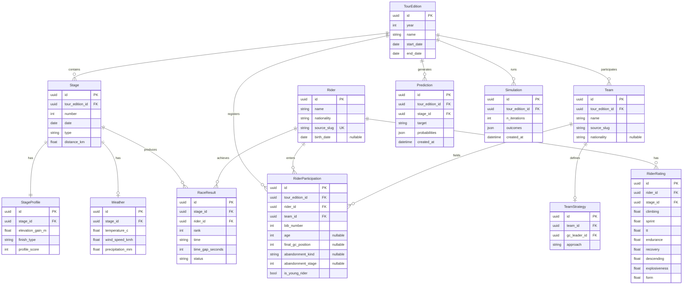

# Entity-Relationship Diagram

Core entities and their relationships for YellowMind.

`Rider` holds identity only, while `RiderParticipation` holds the facts that are true of a rider for one edition: team, bib number, age, and how the race ended. See [ADR-009](../adr/009-rider-identity-and-participation.md) for why the two are separate.

## ERD

## Storage mapping

| Entity group | Primary store | Rationale |
|-------------|---------------|-----------|
| TourEdition, Stage, Rider, RiderParticipation, Team, RaceResult | PostgreSQL | Operational queries, API serving |
| Feature matrices, training data | DuckDB / Parquet | Columnar scans, reproducible ML |
| Model artifacts | MLflow | Versioned experiments and promotion |
| Predictions, Simulations | PostgreSQL | Audit trail, API history |

See [ADR-002: Dual storage](../adr/002-dual-storage.md).
