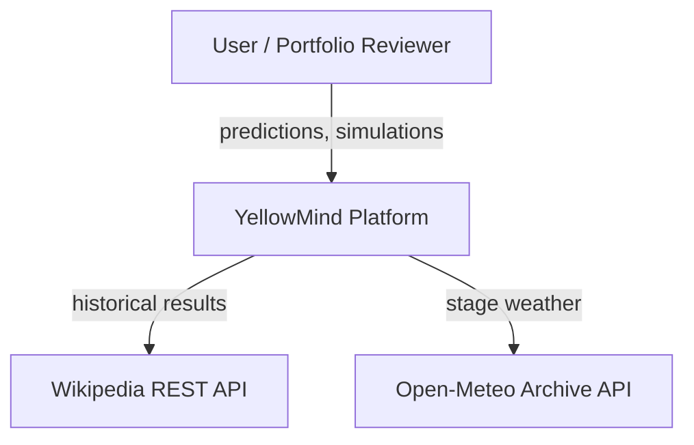
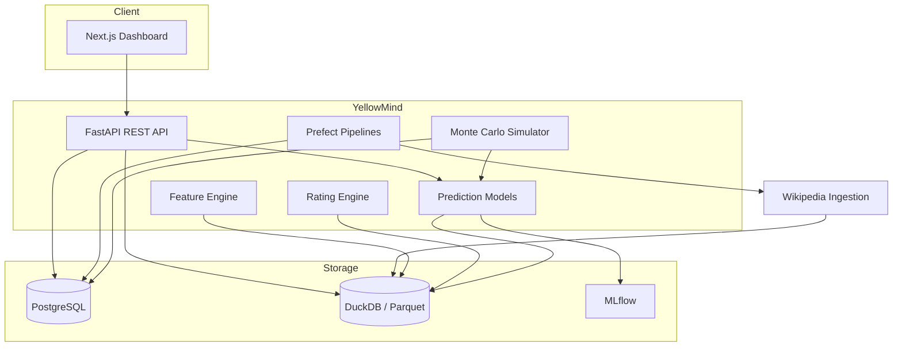
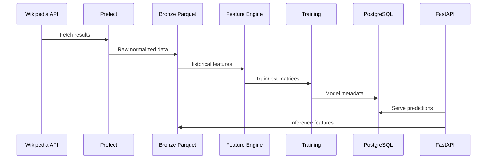

# Architecture Overview

YellowMind follows **Clean Architecture** with a **domain-driven** core. Dependencies point inward: presentation and infrastructure depend on application and domain, never the reverse.

## Context diagram (C4 Level 1)



## Container diagram (C4 Level 2)



## Layer responsibilities

| Layer | Package | Responsibility |
|-------|---------|----------------|
| Domain | `domain/` | Entities, value objects, domain rules, repository interfaces |
| Application | `application/` | Use cases orchestrating domain logic via ports |
| Infrastructure | `infrastructure/` | PostgreSQL, DuckDB, ingestion clients, ML model adapters |
| Presentation | `presentation/` | FastAPI routes, CLI, request/response schemas |

## Data flow



## ML model progression

Every prediction target follows the same ladder — baselines are never skipped:

```
Random → Logistic Regression → Random Forest → LightGBM → CatBoost → XGBoost → Deep Learning → Ensemble → Monte Carlo
```

## Related documents

- [Entity-relationship diagram](erd.md)
- [ADR index](../adr/)
- [Project backlog](../project/BACKLOG.md)
